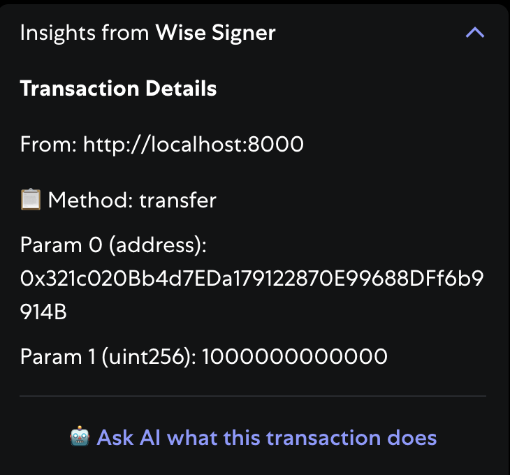

# Wise Signer Snap

> [!Note] 
> This project is in early development and may change significantly. You should *still* do your own due diligence when using it. 
> 
> Also, be careful of your settings if you have auto-explain on, or you could easily run up your bill!

A MetaMask Snap that uses Claude AI to explain blockchain transactions in plain English, helping users understand what they're signing before they sign it.



# Features
1. Built-in buttons to quickly send transaction/signature context to your AI of choice
2. EIP-712 Hash calculation directly in MetaMask
3. Auto-explain mode for seamless transaction analysis
4. Buttons to bring your hex data to an ABI decoding site for further inspection

> [Watch the video here](https://youtu.be/jcFhv8AM2pU)


- [Wise Signer Snap](#wise-signer-snap)
- [Features](#features)
- [Getting Started](#getting-started)
  - [Requirements](#requirements)
    - [Environment Variables](#environment-variables)
  - [Setup](#setup)
  - [Debugging](#debugging)
- [Usage](#usage)
  - [Configuration](#configuration)
  - [Transaction Analysis](#transaction-analysis)
  - [License](#license)
  - [Acknowledgments](#acknowledgments)

# Getting Started

## Requirements

- [node](https://nodejs.org/en/download)
    - You'll know you've installed it right if you can run `node --version` and get a response like `v20.0.0` or higher
- [yarn](https://yarnpkg.com/)
    - You'll know you've installed it right if you can run `yarn --version` and get a response like `1.22.0`
- [MetaMask Flask](https://metamask.io/flask/)
    - Development version of MetaMask that supports Snaps
- [git](https://git-scm.com/downloads)
    - You'll know you've installed it right if you can run `git --version` and get a response like `git version 2.33.0`

### Environment Variables

No environment variables are required! Users provide their own Claude API keys through the Snap's interface.

## Setup

```bash
git clone https://github.com/your-username/wise-signer-snap
cd wise-signer-snap
yarn install
yarn start
```

This will:
1. Install all dependencies
2. Build the Snap
3. Start a local server on `http://localhost:8000`

To install the Snap in MetaMask Flask:
1. Open MetaMask Flask
2. Navigate to `http://localhost:8000` in your browser
3. Click "Connect" when prompted to install the Snap

## Debugging
1. Go to chrome://extensions.
2. Toggle Developer mode on in the top right corner.
3. Find MetaMask Flask, and select Details.
4. Under Inspect views, select `offscreen.html`.

# Usage

## Configuration

1. [Get a Claude API Key](https://console.anthropic.com/settings/workspaces/default/keys)
   
2. **Configure the Snap**:
   - Click on the Snap in MetaMask (Menu → Snaps → AI Transaction Explainer)
   - Paste your Claude API key and click "Save API Key"
   - Choose your preferred model:
     - **Claude Opus 4.1**: Most capable, best for complex transactions
     - **Claude Opus 4**: More balanced performance and speed
     - **Claude Sonnet 4**: Balanced performance and speed
     - **Claude Sonnet 3.7**: Fastest responses
   - Toggle "Auto-Explain" based on your preference

## Transaction Analysis

When you encounter a transaction:

- **With Auto-Explain Enabled**: The Snap automatically analyzes the transaction and shows an AI explanation
- **With Auto-Explain Disabled**: Click "Ask AI inside metamask" to get an analysis
- **Without API Key**: The Snap shows decoded transaction details and prompts you to add an API key

The AI will:
- Identify the contract and method being called
- Explain what the transaction will do
- Highlight any risks or concerns
- Search for information about addresses involved
- Format the explanation with markdown for easy reading

## License

MIT License - see LICENSE.* file for details

## Acknowledgments

- Built on [MetaMask Snaps](https://metamask.io/snaps/)
- Powered by [Claude AI](https://claude.ai)
- Transaction decoding by [@metamask/eth-sig-util](https://www.npmjs.com/package/@metamask/eth-sig-util)